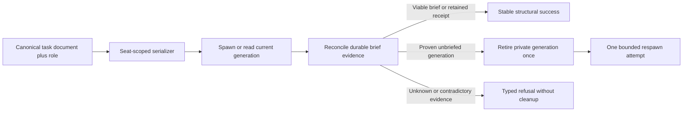

# Structural Application Services Overview

| Field | Value |
|---|---|
| repository | agents-remember |
| doc_type | `route-local-overview` |
| sourceRoute | `mcp/src/agents_remember/application/structural/` |
| onboardingRoute | `mcp/src/agents_remember/application/structural/overview.md` |
| parentOverview | [`application/overview.md`](../overview.md) |
| lastUpdated | 2026-08-26T16:03+02:00 |
| lastVerifiedCommitHash | `c51373425be3e3f488590ad2f444810df89b4ffb` |
| lastVerifiedCommitDate | 2026-08-26T19:22:10+02:00|

## IAS Frozen Structural Admission Boundary

Structural dispatch may trigger atomic-master selection, but it does not acquire task-authoring or
queue authority. A selecting manager/attach path must reconcile the selected series before exposing
implementation work; another live master is paused by the selector rather than deleted, completed,
or rewritten. Any returned sync conflict stays owned by the worktree transaction and is resumed or
cancelled through its contract-addressed public operation.

Task documents remain canonical structural truth throughout this flow. Their otherwise-valid
mutation is never refused because a queue projection or selector exists; downstream scheduling is
invalidated and recomputed from the changed truth.

## What This Area Is

The structural application boundary translates a caller's intent (a hosted seat, or — since
260815-DAG-L16 — a declared role + task document when no plane seat exists) into authorized
document-and-role operations. It owns dispatch, parent/child messaging, retirement, rename, and
delegated gate operations without accepting runtime session, lifecycle, inbox, or gate identifiers
from an agent. The declared-caller fallback grants no authority beyond the same role/document pair
a seat would have (L16 F5 trust model); hosted seats win and a contradicting declared caller
refuses.

## Hot Path Summary

`agent_tools.py` resolves the caller and target structural seats before invoking the existing
plane-owned spawn, inbox, retire, and rename machinery. `gate_tools.py` applies the same boundary to delegated gates; since 260815-DAG-L16 it also accepts an
optional request-carried `caller` (role + task_document_ref) when no plane seat exists, refusing a
declared caller that contradicts the seat (`structural-caller-conflict`). Public response models
expose task-document and role outcomes only.

For L23, dispatch additionally validates transitive task-derived code and external-memory lineage
before host creation. Curator dispatch requires the manager's current-lineage preflight and a
passing independent route-review record bound to the exact candidate tree; the structural boundary
rechecks both rather than trusting brief prose or model-carried commit identities.

Since 260821-ARSPAWN-L1, `dispatch_agent` is the ONE public spawn tool for both caller kinds. A
plane-hosted seat keeps the structural path (identity proof + `authorize_child` child-scope). An
ambient launcher (no `AR_HOSTED_SESSION_ID`) is resolved from the PROCESS ENVIRONMENT by
`serving/ambient_seat.py` — distinct from the L16 request-carried declared-caller path used by gate
tools — and spawns in ambient mode with the pinned dispatch brief and the same rollback, no parent
seat (so seat-authority and child-scope checks do not apply), role altitude still validated, and
`spawnedByKind="ambient"` recorded in spawn provenance. Stale/invalid/mismatched/unbound plane
identity refuses; it never silently downgrades to ambient.

Since 260821-ARSPAWN-L2, the one-call contract is also idempotent at the canonical seat. A
cross-process lock covers the complete spawn-plus-brief transaction for exactly
`(task_document_ref, role)`. `dispatch_transaction.py` reconciles a pre-existing generation from
the durable catalog receipt and exact-pinned inbox row, repairs a missing receipt through the
serving-owned `DispatchBriefReceiptStore`, tolerates inbox
compaction when the receipt survives, and replaces one generation proven to have failed before
briefing. Missing, terminal, mismatched, or otherwise unreadable generation evidence is unknown,
refuses reconciliation, and never licenses cleanup. It refuses contradictions and never retires an
unattributed or manual occupant. Ordinary relationship messages persist the canonical address even
while the seat is vacant, so the next occupant receives them without a dead-session-id rewrite.
Serializer setup or acquisition has one dedicated typed refusal; it does not swallow or relabel
failures raised by the protected transaction.

## What Belongs Here

| Path | Role |
|---|---|
| `agent_tools.py` | Structural dispatch, messaging, retirement, and rename orchestration |
| `gate_tools.py` | Structural lifecycle-gate creation, decision, and listing |

## What Does Not Belong Here

| Nearby Thing | Belongs Instead In |
|---|---|
| Catalog qualification and hierarchy walking | `serving/structural_seats.py` |
| Ambient caller resolution | `serving/ambient_seat.py` |
| Strict agent-facing request/response schemas | `models/structural/` |
| Runtime-id administration | Internal serving/control-plane surfaces, never public structural tools |

## Operating Model

1. Resolve the caller from trusted hosted-process context, or — when the process has no plane seat
   (`ambient-seat-unavailable`) — from the request-carried declared caller, validated by the same
   structural authorization a seat would face.
2. Authorize the requested parent or child relationship from canonical task containment and role.
3. Resolve exactly one current target occupant or return a typed structural failure.
4. Invoke the existing plane-owned mutation using runtime ids internally.
5. Return only structural work-domain identity to the model.

## Main Flows

### Dispatch

1. Validate the requested child role and contained task document.
2. Spawn and bind the child occupant.
3. Persist an internally exact-pinned initial dispatch brief.
4. Retire an unbriefed child if that transaction fails.

### Ordinary relationship traffic

1. Persist a document-and-role structural address.
2. Re-resolve its current occupant immediately before delivery.
3. Preserve the same address across parent or child replacement.

## Load-Bearing Files

| File | Role | Why It Matters | Onboarding |
|---|---|---|---|
| `agent_tools.py` | application boundary | Prevents model-supplied runtime addressing | covered |
| `gate_tools.py` | authorization boundary | Prevents exact lifecycle/gate targeting by agents | covered |

## Local Invariants And Traps

- No public structural request or response carries a runtime id.
- Initial dispatch remains exact-pinned internally; ordinary relationship traffic remains rebindable.
- Missing or ambiguous seats fail closed; no same-role global fallback is permitted.
- This package composes existing primitives and must not create a second lifecycle implementation.

## Repo-Internal References

| Finding | Anchor | Source |
| --- | --- | --- |
| The public structural operations are registered through one adapter module. | `dispatch_agent_payload` | mcp/src/agents_remember/mcp/tools/structural_agent.py:31-114 |
| Structural resolution qualifies document+role seats and refuses ambiguity. | `StructuralSeatResolver` | mcp/src/agents_remember/serving/structural_seats.py:24-157 |

## Cross-Repo References

No cross-repository runtime dependency governs this package.

## Docs References

The resolved memory source registry has no configured Domain Documentation entry. The implementation
contract is therefore evidenced by repository source, tests, and the approved task design.

## File-Level Onboarding Map

| Source File | Onboarding File | Status | Reason |
|---|---|---|---|
| `application/structural/__init__.py` | [`__init__.py.md`](__init__.py.md) | covered | Package marker |
| `application/structural/agent_tools.py` | [`agent_tools.py.md`](agent_tools.py.md) | covered | Agent structural boundary |
| `application/structural/gate_tools.py` | [`gate_tools.py.md`](gate_tools.py.md) | covered | Gate structural boundary |

## Child Overviews

No child overview is needed for this bounded package.

## How To Use This Area

Read this overview, the target file card, `serving/structural_seats.py.md`, and the strict model
card before changing a structural operation.

## Needs Verification

None.

## 260815-DAG-L4 L4 Organizational And Atomic Dispatch

Structural dispatch distinguishes organizational masters, whose leaves start directly from the sprint super, from atomic masters, whose task-owned series refs are journaled before child admission. Dispatch never creates a universal master branch for organizational work.

## 260815-DAG Master Full-Gate Repair Route Impact

`agent_tools.py` imports updated to the moved `application/task_docs/task_ref` location.

## 260821-ARSPAWN-L2 Canonical Dispatch Architecture

Structural dispatch is a transaction over one canonical `(taskDocumentRef, role)` seat. Runtime
session ids identify private catalog generations and exact initial-brief correlation only; they
never become caller-facing addresses or stable result identity.

`exclusive_structural_dispatch_lock` combines a reclaimed in-process slot with a POSIX lock in
one of 4,096 deterministic hash stripes. It serializes only the selected seat; hash collisions
may conservatively serialize unrelated seats. Lock creation or acquisition failure becomes
`StructuralDispatchLockError`; there is no process-local fallback and lock files are not unlinked.

`execute_dispatch_transaction` owns the bounded spawn/reconcile loop. Durable pinned-brief
evidence is the commit point: a viable brief converges, a missing catalog receipt is repaired,
and a retained receipt survives inbox compaction as queued. A non-dispatch occupant remains
`seat-taken`. Only a positively proven unbriefed dispatch generation may be retired; disappeared,
unreadable, or contradictory evidence refuses. Public payloads are built by `StructuralOutcome`
and exclude occupant ids.

`current_seat_occupant` is the shared generation selector. It fails closed on duplicate primaries
or duplicate staged heirs, prefers one live incumbent, and promotes the one heir only after the
incumbent leaves. Message envelopes remain address-only and delivery re-resolves this selector,
so planning and messaging remain valid while a seat is vacant or replaced.

## Update History

- 2026-08-26T16:03+02:00 — Post-failure repair: recorded the receipt-store collaborator and
  rechecked the bounded two-generation transaction without changing public seat identity.
  Verification remains closeout-owned.

- 2026-08-26T12:30+02:00 — Reconciled the complete ARSPAWN-L2 canonical-seat transaction, bounded recovery,
  serializer, replacement, and public-outcome architecture onto the audited IAS overview.
  Verification remains closeout-owned.

- 2026-08-26T08:55+02:00 — Finalized the IAS structural-admission boundary label against the
  frozen pass-13 candidate.

- 2026-08-21T02:50+02:00 — 260821-ARSPAWN-L1 route impact: `dispatch_agent` is the one public spawn tool for both caller kinds — plane seats keep the structural path; ambient launchers (no `AR_HOSTED_SESSION_ID`) are resolved from the process environment (distinct from the L16 gate-tools declared caller) and spawn with the pinned brief + same rollback, no parent seat, role altitude still validated, provenance `spawnedByKind="ambient"`. Verification metadata pinned until closeout stamps the 260821-ARSPAWN-L1 commit.

- 2026-08-21T00:45+02:00 — 260815-DAG master full-gate repair route impact: import-path updates to the moved task_docs package. Verified at code commit e5cb139f.

- 2026-08-20T09:35+02:00 — 260815-DAG-L16 route impact: the structural gate boundary gains the
  declared-caller fallback (`caller` request data on `lifecycle_gate`/`gate_decide`/`gate_list` when
  no plane seat exists; hosted seat wins; contradiction refuses). F3 sweep: the overview no longer
  claims the boundary translates only "an ambient hosted seat's intent" or resolves callers only
  from trusted hosted-process context. Verified at code commit a9d50e08.

- 2026-08-19T22:32+02:00 — 260815-DAG-L13 route impact: manager series bootstrap in
  `agent_tools.py` gates on the effective execution nature (nature-less masters default atomic;
  organizational semantics only under an authored graph) and surfaces an atomic-sequential
  lane-blocked bootstrap as a failed `StructuralOutcome` carrying the ordering payload; the
  structural-route model is unchanged. Verification remains closeout-owned.

- 2026-08-15T23:38+02:00 — 260815-DAG-L4: reconciled this governing route with the frozen integration-authority implementation and forcing surface. Verification remains closeout-owned.

- 2026-08-14T06:20+02:00 — L23 curator: documented pre-host lineage and candidate-bound route-review
  admission for curator dispatch. Verification provenance remains closeout-owned.

- 2026-08-11T06:47+02:00 — 260731-EFA-L19: created for the new structural application package.
