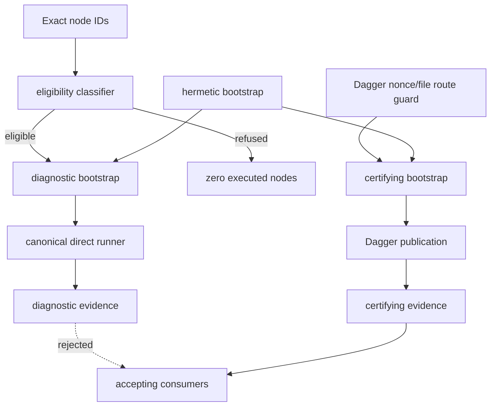

# Python Testing Boundary Overview

| Field | Value |
| --- | --- |
| repository | agents-remember |
| doc_type | `route-local-overview` |
| sourceRoute | `mcp/src/agents_remember/testing/` |
| onboardingRoute | `onboarding/mcp/src/agents_remember/testing/overview.md` |
| parentOverview | [`mcp overview`](../../../overview.md) |
| lastUpdated | 2026-08-24T20:55+02:00 |
| lastVerifiedCommitHash | `77bc614506b8b50937aed6846523547d36045947` |
| lastVerifiedCommitDate | 2026-08-24T20:41:34+02:00 |

## What This Area Is

This route owns Python-test execution policy below the quality/lifecycle plane. It separates three
questions that previously leaked into one root conftest boundary:

1. whether an exact bounded selector is structurally safe for a direct diagnostic;
2. how either route prepares a deterministic candidate-bound pytest process; and
3. whether the current process has Dagger admission and may participate in certifying execution.

The two execution routes share hermetic bootstrap, random order, owned-global restoration, and
route-neutral phase reporting. They do not share evidence authority. Direct output is permanently
diagnostic; quality, coverage, retry, lifecycle, closeout, and integration consume only
candidate-bound evidence published by the Dagger executor.

## Hot Path Summary

Start with `eligibility.py`, `dependency_closure.py`, and `unsafe_effects.py` for admission policy;
`direct_runner.py` for the only direct command; `dagger_admission.py` and
`certifying_bootstrap.py` for the certifying route; and `selection_contract.py` plus
`models/test_evidence.py` for the typed boundary between classification, execution, and consumers.

## What Belongs Here

| Path | Role |
| --- | --- |
| `selection_contract.py` | Closed classifier result, refusal, observation, and unsafe-family types. |
| `python_source.py`, `collection_closure.py`, `dependency_closure.py` | Parse-only source/dependency closure; candidate code is never imported to classify it. |
| `unsafe_effects.py`, `eligibility.py` | Sole structural policy and whole-request decision owner. |
| `hermetic_bootstrap.py`, `global_state.py`, `random_order.py` | Shared deterministic process state. |
| `dagger_admission.py`, `certifying_bootstrap.py` | Dagger-only route guard and certifying composition. |
| `diagnostic_bootstrap.py`, `direct_runner.py` | Still-current selection validation and exact serial diagnostic execution. |
| `pytest_bootstrap.py`, `pytest_certifying_bootstrap.py` | Shared versus certifying-only pytest plugins. |
| `pytest_phase_reporter.py` | Route-neutral timestamps and node outcomes; no authority. |
| `consumer_inventory.py` | Closed accepting-consumer inventory used by firewall proof. |

## What Does Not Belong Here

| Nearby Thing | Belongs Instead In |
| --- | --- |
| Quality-step planning, coverage, CRAP, diff floor | `mcp/src/agents_remember/code_quality/` |
| Immutable Dagger generation publication and verification | `mcp/src/agents_remember/worktrees/modules/` |
| Diagnostic/certifying serialized evidence model | `mcp/src/agents_remember/models/test_evidence.py` |
| Dagger container graph and secret-free nonce creation | `.dagger/src/agents_remember_quality/main.py` |
| Cohort and boundary explanations | `docs/design/python-*.md` |

## Operating Model

### Direct diagnostic flow

1. `scripts/test-python` supplies only normalized exact pytest node IDs to `direct_runner`.
2. The total classifier resolves the whole request, with an eight-node maximum and no flags.
3. Collection-time code, imports, fixtures, helpers, constructors, and calls are followed
   statically. Any unknown dependency or closed unsafe family refuses the entire request.
4. The runner rechecks the candidate binding, scrubs Git selectors and Dagger admission, forces
   serial pytest with the canonical config, and executes exactly once.
5. A candidate change, missing/contradictory phase record, or closure drift is infrastructure
   failure. There is no smaller-subset or Dagger fallback.
6. The result is `DiagnosticTestEvidence`; accepting consumers reject it by type and altitude.

### Certifying flow

1. The Dagger graph creates the process nonce/file handshake.
2. `dagger_admission` validates it before candidate planning, plugin loading, or collection and
   returns the module-minted capability.
3. `certifying_bootstrap` combines admission with the same hermetic candidate process used by
   diagnostics; `pytest_certifying_bootstrap` alone binds worktree/provider services.
4. The quality wrapper requires the admission capability before pytest, coverage, or retry proof.
5. The clean executor publishes one immutable, digest-verified schema-2 report generation bound to
   the candidate tree. That publication, not the in-process nonce by itself, mints certifying
   evidence.

## Local Invariants And Traps

- Eligibility is structural and fail-closed. Names, markers, directories, past results, or a human
  assertion of purity never grant admission.
- Classification parses candidate source but never imports or executes it.
- The whole selection is atomic: one refusal means zero nodes run.
- `DependencyClosureAnalyzer` cache identity includes file, function name, and source line; methods
  with the same name in different classes must be scanned independently.
- Direct execution accepts no arbitrary pytest flags, forces `-n=0`, and has no compatibility or
  fallback route.
- The nonce/file handshake guards ordinary wrong-route invocation. It cannot authenticate against
  a repository owner who controls code, interpreter, environment, and filesystem; durable Dagger
  publication is the acceptance boundary.
- Missing phase timestamps serialize as `null` so reporting never masks pytest's original exit.
- Phase timing and node outcome records are observations, not acceptance evidence.
- Vitest policy is unchanged by this route.

## Repo-Internal References

| Finding | Citations | Source Path |
| --- | --- | --- |
| The total classifier owns the exact request and maximum node count. | L23-L59 | `mcp/src/agents_remember/testing/eligibility.py` |
| The static analyzer identifies functions by path, name, and line. | L39-L47; L170-L185 | `mcp/src/agents_remember/testing/dependency_closure.py` |
| Direct execution emits diagnostic-only payloads and no certifying field. | L35-L39; L101-L124; L165-L228 | `mcp/src/agents_remember/testing/direct_runner.py` |
| Dagger admission validates before certifying composition. | L55-L100 | `mcp/src/agents_remember/testing/dagger_admission.py` |
| Evidence consumers reject diagnostic altitude. | L14-L105; L143-L174 | `mcp/src/agents_remember/models/test_evidence.py` |
| The bounded real cohort contains exactly seven production assertions. | L1-L54 | `mcp/tests/test_python_direct_cohort.py` |

## Cross-Repo References

No external repository supplies or overrides this route's eligibility, bootstrap, or evidence
authority.

## Docs References

The implementation rationale and command contract are in `docs/design/python-direct-diagnostics.md`,
`docs/design/python-pytest-bootstrap.md`, `docs/design/python-test-evidence.md`, and
`docs/design/python-direct-cohort.md`. No external domain-documentation source is configured.

## File-Level Onboarding Map

| Source File | Onboarding File | Status | Reason |
| --- | --- | --- | --- |
| `testing/__init__.py` | [`__init__.py.md`](__init__.py.md) | covered | Narrow public testing API. |
| `testing/certifying_bootstrap.py` | [`certifying_bootstrap.py.md`](certifying_bootstrap.py.md) | covered | Certifying composition. |
| `testing/collection_closure.py` | [`collection_closure.py.md`](collection_closure.py.md) | covered | Import-time closure. |
| `testing/consumer_inventory.py` | [`consumer_inventory.py.md`](consumer_inventory.py.md) | covered | Acceptance-edge inventory. |
| `testing/dagger_admission.py` | [`dagger_admission.py.md`](dagger_admission.py.md) | covered | Dagger route guard. |
| `testing/dependency_closure.py` | [`dependency_closure.py.md`](dependency_closure.py.md) | covered | Recursive static closure. |
| `testing/diagnostic_bootstrap.py` | [`diagnostic_bootstrap.py.md`](diagnostic_bootstrap.py.md) | covered | Diagnostic composition. |
| `testing/direct_runner.py` | [`direct_runner.py.md`](direct_runner.py.md) | covered | Canonical direct command. |
| `testing/eligibility.py` | [`eligibility.py.md`](eligibility.py.md) | covered | Sole admission policy. |
| `testing/global_state.py` | [`global_state.py.md`](global_state.py.md) | covered | Shared state restoration. |
| `testing/hermetic_bootstrap.py` | [`hermetic_bootstrap.py.md`](hermetic_bootstrap.py.md) | covered | Candidate process isolation. |
| `testing/pytest_bootstrap.py` | [`pytest_bootstrap.py.md`](pytest_bootstrap.py.md) | covered | Shared pytest hooks. |
| `testing/pytest_certifying_bootstrap.py` | [`pytest_certifying_bootstrap.py.md`](pytest_certifying_bootstrap.py.md) | covered | Certifying services. |
| `testing/pytest_phase_reporter.py` | [`pytest_phase_reporter.py.md`](pytest_phase_reporter.py.md) | covered | Route-neutral evidence. |
| `testing/python_source.py` | [`python_source.py.md`](python_source.py.md) | covered | AST/source graph. |
| `testing/random_order.py` | [`random_order.py.md`](random_order.py.md) | covered | Deterministic order. |
| `testing/selection_contract.py` | [`selection_contract.py.md`](selection_contract.py.md) | covered | Typed classifier vocabulary. |
| `testing/unsafe_effects.py` | [`unsafe_effects.py.md`](unsafe_effects.py.md) | covered | Closed safety policy. |

## Child Overviews

None. This route is intentionally one cohesive testing boundary.

## How To Use This Area

Read this overview, then the cards for the classifier/runner or admission/bootstrap side you are
changing. Any proposal that admits a new construct or effect family changes policy and requires an
explicit decision; it is not an incidental test-fixture fix.

## Needs Verification

None for the candidate bound above. The master-level Dagger result remains acceptance evidence and
is recorded outside onboarding.

## Update History

- 2026-08-24T20:55+02:00 — 260824-PDLS created the testing route after separating structural
  diagnostics, reusable bootstrap, Dagger admission, and evidence altitude end to end.
